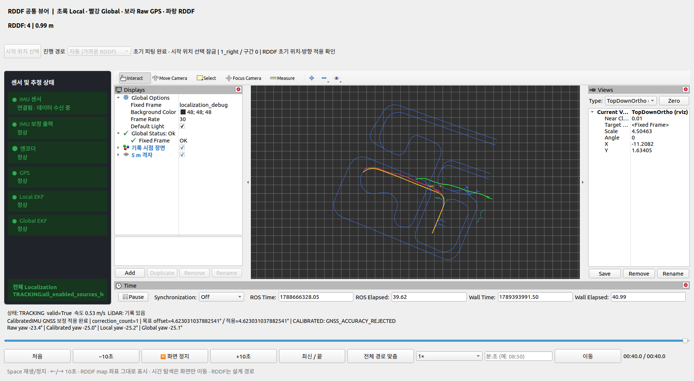
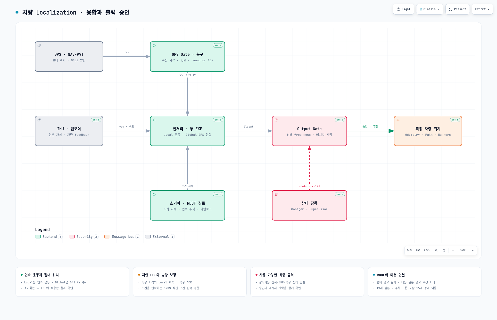
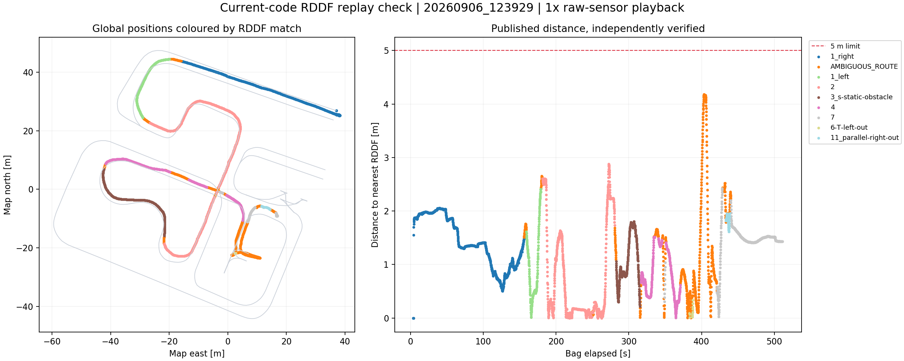

# HL-FMA 2026 · Vehicle Localization

- **구현 방식:** ROS1에서 `robot_localization`의 Local·Global EKF를 구성해 IMU·엔코더 기반 운동 추정과 GPS 절대 위치 보정을 결합했습니다.
- **수행 기능:** 센서 전처리, GPS 품질·시간 정합 검증과 복구, RDDF 기반 초기화·연속 경로 추적, 최종 위치·상태 출력을 구현했습니다.
- **설계 특징:** 연속 운동 추정과 GPS 보정 승인을 분리하고, 출력 유효성 검사와 경로 연속성 관리로 주행 모듈에 위치 사용 가능 상태를 제공합니다.



*실제 센서 rosbag을 재생한 기존 구현의 실행 화면(2026-09-14). 초록 Local, 빨강 Global, 보라 GPS, 파랑 RDDF, 노랑 현재 경로를 표시합니다. 화면은 당시 기록이며 이번 최종 소스를 새로 실행한 캡처는 아닙니다.*

HL-FMA 2026 차량 프로젝트에서 개발한 localization을 독립 저장소로 정리했습니다. **최종 기준은 [Team-Stier/HL-FMA-1-5-2026](https://github.com/Team-Stier/HL-FMA-1-5-2026/tree/fba9a5c12382a61a2711fe5685fe839e20c804c3/src/localization)의 localization**입니다. 센서 전처리, 두 EKF, GPS 검증·복구, RDDF 초기화·연속 추적, 출력 승인과 RViz 뷰어를 포함합니다.

> ROS1 Noetic · C++14 · Python 3 · `robot_localization` · Xsens IMU · u-blox GNSS · Arduino/ERP42 feedback
>
> Vehicle localization with dual EKFs, timestamp-aware GNSS gating, coordinated recovery, and continuous RDDF tracking.

[아키텍처](#설계와-데이터-흐름) · [빠른 시작](#빠른-시작) · [실행 방법](#실행-방법) · [최종 설정](#최종-버전의-운영-설정) · [검증](#검증)

## 해결하려는 문제

IMU·엔코더는 연속적인 움직임을 제공하지만 오차가 누적됩니다. GPS는 절대 위치를 제공하지만 지연·단절·잘못된 측정이 발생할 수 있습니다. 경로가 겹치는 주차 구간이나 교차점에서는 가장 가까운 경로만 골라도 현재 RDDF가 바뀔 수 있습니다.

이 시스템은 **운동 추정**, **GPS 보정의 승인**, **위치 출력의 승인**, **현재 경로의 연속성 유지**를 각각 맡는 구성요소로 나눕니다. 화면에 EKF 궤적이 보이는 것과 최종 위치가 사용 가능한 상태인 것은 별개입니다.

## 주요 구현

| 구현 | 하는 일 | 코드 |
|---|---|---|
| 센서 전처리 | 엔코더 피드백의 속도·기어 처리, IMU 메시지·좌표·공분산 정규화 | [IMU·엔코더](src/localization/src/imu_encoder_fusion/) |
| IMU 방향 보정 | 초기 RDDF 방향 정합, 정지 중 yaw 유지, GNSS 직진 구간의 반복 방향 보정 | [CalibratedIMU](src/localization/scripts/calibrated_imu_core.py) |
| Local / Global EKF | Local의 연속 운동 추정, Global의 승인 GPS XY 추가 융합 | [Local](src/localization/config/ekf_local.yaml), [Global](src/localization/config/ekf_global.yaml) |
| GPS 품질·시각 게이트 | fix·frame·timestamp·covariance·예측 편차 검사, GPS 측정 시각의 Local 이력 정합, 레버암 보정 | [GPS fusion](src/localization/src/odometry_gps_fusion/) |
| 초기화·복구 | GPS 또는 수동 RDDF 초기 자세 적용 확인, 장기 단절 뒤 reanchor transaction/ACK 처리 | [초기화](src/localization/scripts/rddf_initializer_node.py), [복구](src/localization/src/relocalization/) |
| 상태·출력 승인 | 센서·EKF·복구 상태 감독과 최종 Global 메시지 계약 검사 | [Supervisor](src/localization/src/supervisor/), [Output Gate](src/localization/src/output_gate/) |
| RDDF 연속 추적 | 활성 원본 경로 유지, 연결된 다음 구간 전환, 미션의 분기 요청 처리, 주차 진입·진출 그룹화 | [Tracker](src/localization/scripts/rddf_tracking_core.py) |
| 경로 카탈로그·뷰어 | RDDF 원본을 RouteMap으로 제공, 궤적·센서 상태·현재 경로 표시와 시간 탐색 | [Provider](src/localization/scripts/rddf_route_provider.py), [뷰어](src/localization/scripts/localization_viewer.py) |

EKF 계산은 외부 패키지 `robot_localization`을 사용합니다. 이 저장소는 차량별 전처리·융합 구성·품질 판단·초기화·복구·출력 계약과 경로 추적을 구현합니다. LiDAR는 원시 스캔 수집과 표시에 사용합니다. Scan matching으로 위치를 보정하는 구현은 포함하지 않습니다.

## 설계와 데이터 흐름



[Archify HTML 뷰어·검증 기록](docs/architecture/README.md) · [JSON 원본](docs/architecture/localization.architecture.json) · [상세 아키텍처](src/localization/docs/architecture.md)

그림은 책임별 개요입니다. HTML을 다운로드해 브라우저에서 열면 확대·검색·Light/Dark·Export를 사용할 수 있습니다. GitHub 파일 보기에서는 HTML이 실행되지 않습니다. 설명은 한국어이며 고정 뷰어 버튼은 영어입니다.

- **Local EKF**는 보정 IMU yaw/yaw rate와 엔코더 전방 속도, `vy=0` 차량 모델 제약을 사용합니다.
- **Global EKF**는 같은 운동 입력에 승인된 GPS XY를 추가합니다. 상관된 정보를 중복 융합하지 않도록 Local Odometry 자체를 다시 융합하지 않습니다.
- **지연 GPS**는 측정 시각의 Local pose를 이력에서 정합합니다. Global EKF도 과거 필터 이력으로 지연 측정을 재처리합니다.
- **최종 출력**은 Supervisor 승인과 Output Gate의 메시지·freshness 검사를 함께 거칩니다.
- **RDDF Tracker**는 첫 위치·방향으로 경로를 고른 뒤 현재 원본 경로를 유지합니다. 주차·종료 분기는 State Manager의 다음 원본 경로 요청을 받아 연결 조건을 확인합니다. 주차 좌우별 진입·진출은 하나의 공개 이름으로 그룹화합니다.

좌표는 ENU(동쪽 X, 북쪽 Y), 거리 m, 각도 rad입니다. Global EKF가 `map → odom`, Local EKF가 `odom → base_link`를 소유합니다. 센서 장착·기준점은 [TF 문서](src/localization/docs/tf_frames.md), 경로·미션 연결은 [RDDF 인터페이스](src/localization/docs/operations.md#현재-rddf-경로-구독)를 참고합니다.

## 저장소 구성

```text
src/
├── localization/              # ROS 패키지명: mando_localization
│   ├── src/                   # C++ 전처리·GPS gate·상태·복구·출력·TF
│   ├── scripts/               # Python 초기화·IMU 보정·RDDF·뷰어·시각 진단
│   ├── config/                # 센서·EKF·품질·복구·장착·경로 정책 YAML
│   ├── launch/                # 실시간·재생·뷰어 구성
│   ├── msg/ · srv/            # RDDF·GPS 복구 메시지와 방향 설정 서비스
│   ├── rddf/                  # 용인 코스 원본 CSV·그룹·미션 마커
│   ├── test_data/             # 운동장 좌표로 옮긴 RDDF 테스트 사본
│   ├── test/                  # C++·Python 단위 테스트와 ROS 통합 테스트
│   └── docs/                  # 상세 설명과 운영 가이드
├── erp42_msgs/                # 기존 차량 feedback 메시지
└── planning_interfaces/       # Route / RouteMap 등 기존 통합 메시지
assets/                        # 실제 실행 화면과 Archify 이미지
```

Perception·Planning·Control·State Manager 구현, 센서 드라이버 소스, 대용량 rosbag과 빌드 결과는 포함하지 않습니다. 지원 메시지는 원본 계약을 유지하며 새로 작성한 알고리즘으로 소개하지 않습니다. [추출 범위·출처](docs/PROVENANCE.md)를 참고합니다.

## 빠른 시작

기준 환경은 **Ubuntu 20.04 + ROS1 Noetic + Python 3**입니다. ROS Noetic, `catkin_make`, `rosdep`이 설치되고 `rosdep init`이 완료된 환경에서 실행합니다.

```bash
source /opt/ros/noetic/setup.bash
mkdir -p ~/work
cd ~/work
git clone https://github.com/simonpaik04/HL-FMA-2026-Localization.git
cd HL-FMA-2026-Localization
rosdep update
rosdep install --from-paths src --ignore-src --rosdistro noetic -r -y \
  --skip-keys="xsens_mti_driver"
catkin_make -j4 -l4 -DPYTHON_EXECUTABLE=/usr/bin/python3
source devel/setup.bash
```

`xsens_mti_driver`는 실 IMU 사용 시 별도로 설치합니다. 센서 없이 빌드·합성 입력 테스트를 실행할 수 있습니다. 실센서 사용에는 드라이버와 차량별 장착·포트 설정이 필요합니다. 프로젝트의 수정 u-blox 드라이버는 GNSS 타이밍 진단을 제공하며, 일반 배포판 드라이버와 동일한 동작을 가정하지 않습니다. [드라이버 준비](docs/PROVENANCE.md#드라이버와-외부-의존성)를 확인합니다.

## 실행 방법

새 터미널마다 ROS와 이 저장소의 `devel/setup.bash`를 source합니다.

### 센서 없이 초기화 확인

```bash
rostest mando_localization rddf_initialization.test
rostest mando_localization rddf_initialization_manual.test
```

합성 ROS 입력으로 노드의 초기화 동작을 확인하는 테스트입니다. 실제 차량 연결은 필요하지 않습니다.

### 실시간 센서 융합

외부 드라이버가 이미 실행되고 입력 토픽이 연결된 경우:

```bash
roslaunch mando_localization bringup.launch \
  start_encoder_driver:=false \
  start_imu_driver:=false \
  start_gps_driver:=false
```

기본 시작은 RDDF 초기화입니다. 차량을 실제 RDDF 중심선과 설정된 차량 방향에 놓고 정지시키면 안정된 GPS 후보로 초기 자세를 선택합니다. GPS가 없거나 경로가 겹치면 뷰어의 **시작 위치 선택**으로 원본 경로와 차량 방향을 확인해 수동 선택합니다. IMU·두 EKF에 초기 자세를 적용한 뒤 결과를 확인합니다.

GPS를 사용하지 않는 명시적인 수동 anchor 모드는 `enable_gps_fusion:=false`로 실행합니다. 이 경우 위치는 IMU·엔코더로 이어가는 상대 추정이며 지속적인 GPS 절대 위치 보정을 의미하지 않습니다. [초기화 가이드](src/localization/docs/rddf_startup.md)를 참고합니다.

RDDF 카탈로그만 외부 모듈에 제공하려면 별도 터미널에서 실행합니다. 단독 `bringup.launch`는 Provider를 자동 실행하지 않습니다.

```bash
rosrun mando_localization rddf_route_provider.py \
  _rddf_directory:="$(rospack find mando_localization)/rddf"
```

### 원본 rosbag으로 다시 계산

```bash
roslaunch mando_localization replay.launch bag:=/absolute/path/to/raw.bag
```

원본 센서 토픽과 `/clock`을 재생하고 현재 코드로 위치를 재계산합니다. 기록된 EKF 출력·TF를 함께 입력하지 않습니다. bag은 이 저장소에 포함하지 않습니다.

| 입력 | 기본 토픽 | 메시지 |
|---|---|---|
| 원본 IMU | `/mando_localization/internal/driver/imu` | `sensor_msgs/Imu` |
| 원본 GPS | `/mando_localization/internal/driver/gps_fix` | `sensor_msgs/NavSatFix` |
| GNSS 주행 방향 | `/mando_localization/internal/driver/gps_navpvt` | `ublox_msgs/NavPVT` |
| 엔코더 feedback | `/erp42_serial/feedback` | `erp42_msgs/SerialFeedBack` |
| LiDAR, 표시용 | `/molit/sensors/lidar/scan` | `sensor_msgs/LaserScan` |

외부 드라이버 토픽이 다르면 remap이 필요합니다. [인터페이스 YAML](src/localization/config/localization_interfaces.yaml)과 [relay 어댑터](src/localization/src/common/localization_interface_adapter.cpp)가 기준입니다.

## 출력과 경로 인터페이스

| 토픽 | 용도 |
|---|---|
| `/molit/localization/local/odometry` | 연속 운동 추정·디버깅 |
| `/molit/localization/global/odometry` | GPS를 추가 융합한 EKF 추정·디버깅 |
| `/molit/localization/odometry` | Output Gate를 통과한 최종 위치 |
| `/molit/localization/state`, `/molit/localization/valid` | 상태와 위치 사용 가능 여부 |
| `/molit/localization/status` | 상태 판단 진단 |
| `/molit/localization/rddf/current` | 현재 공개 경로·원본 경로·투영 위치·후보 |
| `/mission/rddf_successor` | 미션 모듈이 요청하는 다음 원본 RDDF 이름 |
| `/route/map` | Provider가 발행하는 원본 경로 카탈로그 |

주차 그룹의 공개 이름은 `T_left`, `T_right`, `parallel_left`, `parallel_right`입니다. 원본 경로는 `source_route_name`과 후보 정보로 구분합니다. 경로 카탈로그는 19개 원본 경로, 공개 경로 식별자는 15개입니다. 이 저장소는 미션 요청을 소비하지만 State Manager 자체는 포함하지 않습니다.

## 최종 버전의 운영 설정

다음은 추출한 원본의 현재 설정입니다. 실제 위치 정확도나 검증 완료 수치로 해석하지 않습니다.

| 항목 | 현재 동작·값 |
|---|---|
| GNSS 방향 보정 | `one_shot: false`로 조건을 만족하는 직진 구간에서 반복 정합 |
| 특정 경로 진입 yaw | 설정된 `3_s-static-obstacle`, `8_dynamic-obstacle`, `T_left`, `T_right` 진입 시 RDDF 방향 정합 |
| GPS가 활성화된 뒤 단절 | DR 예산 `2000초 / 1000m`, 먼저 초과하는 기준 적용 |
| GPS 비활성 모드 | 수동/RDDF anchor와 정상 운동·Global 출력으로 `DEAD_RECKONING`, 위 GPS 단절 예산 분기 미적용 |
| GPS 비활성 출력 공분산 | 위치 variance 제한 대신 전체 covariance 상한 검사 사용 |
| 호스트 시각 검사 | NTP 진단은 유지, `enforce_host_clock_ready: false`로 호스트 검사 결과의 운행 차단 비활성 |
| 초기화 확인 3초 | 지연 안내 기준이며 초과 후에도 EKF 적용 확인을 계속 기다림 |
| GPS-only 자동 Global reset | 기본 비활성 |

공개 상태는 `INITIALIZING`, `TRACKING`, `DEGRADED`, `DEAD_RECKONING`, `RELOCALIZING`, `FAULT`입니다. 최종 출력 중단은 제동 명령이 아니며 Controller의 연동 처리는 별도입니다. RDDF는 설계 경로이고 GPS 레버암·장착 설정은 적용 차량에 맞게 확인합니다. [현재 설정과 모드](src/localization/docs/final_configuration.md)를 참고합니다.

## 검증

```bash
catkin_make -j4 -l4 run_tests_mando_localization
catkin_test_results build/test_results
```

테스트는 상태·출력 게이트, GPS 지연·복구, IMU 보정, RDDF 초기화·연속 추적·그룹·분기, 뷰어와 시각 진단을 다룹니다. 독립 빌드는 성공했습니다. 최종 Catkin 집계는 **290 tests, 0 errors, 5 failures**입니다. 원본 테스트와 현재 동작이 불일치하는 5개 항목은 [검증 기록](docs/VALIDATION.md)에 명시했습니다. 핵심 구현과 기대값을 임의로 바꾸지 않았습니다.

측량 ground truth 기반 RMSE나 이번 소스의 실차 주행 정확도 평가는 포함하지 않습니다. 대표 이미지는 기존 rosbag 재생 결과이며, 아래 그래프의 RDDF 거리는 설계 경로와 추정 위치의 거리입니다.

<details>
<summary>과거 rosbag 재생 궤적과 RDDF 매칭 거리</summary>



2026-09-14 기존 구현의 재생 기록입니다. 새 소스의 평가나 차량 위치 ground truth 오차로 해석하지 않습니다.

</details>

## 상세 문서

[문서 목차](src/localization/docs/README.md) · [아키텍처](src/localization/docs/architecture.md) · [설정](src/localization/docs/configuration.md) · [RDDF 초기화](src/localization/docs/rddf_startup.md) · [GPS 품질·복구](src/localization/docs/gps_quality_and_recovery.md) · [센서 시각](src/localization/docs/sensor_timing.md) · [IMU 보정](src/localization/docs/calibrated_imu.md) · [상태·출력](src/localization/docs/status_and_recovery.md) · [TF](src/localization/docs/tf_frames.md) · [운영·메시지 상세](src/localization/docs/operations.md)

원본의 패키지·외부 코드·기존 라이선스 표기는 [출처 문서](docs/PROVENANCE.md)에 정리했습니다.
