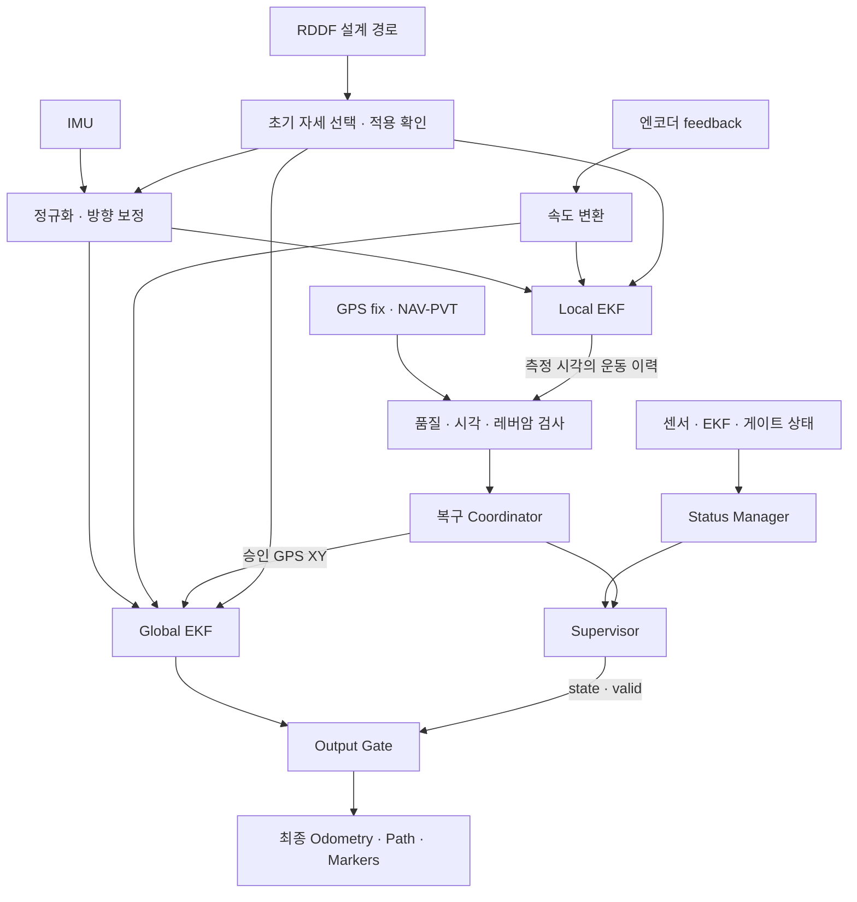

# HL-FMA 2026 · Vehicle Localization

**IMU·엔코더·GPS를 융합하고, 추정 위치를 사용할 수 있는 상태인지 함께 판단하는 ROS1 차량 위치 추정 시스템입니다.**

HL-FMA 2026 차량 프로젝트에서 개발한 localization을 별도 저장소로 정리했습니다. 센서 전처리부터 두 단계 EKF, GPS 품질 검사, 초기화·장애 복구, 최종 출력 승인과 디버깅 뷰어까지의 연결을 살펴볼 수 있습니다.

> ROS1 Noetic · C++14 · Python 3 · `robot_localization` · Xsens IMU · u-blox GNSS · Arduino/ERP42 feedback
>
> A ROS1 vehicle localization pipeline with dual EKFs, timestamp-aware GNSS gating, coordinated recovery, and fail-closed odometry publication.

[설계와 데이터 흐름](#설계와-데이터-흐름) · [빠른 시작](#빠른-시작) · [실행 방법](#실행-방법) · [검증](#검증) · [상세 문서](#상세-문서)

## 해결하려는 문제

차량의 위치는 센서 하나만으로 안정적으로 추정하기 어렵습니다. IMU·엔코더는 연속적인 움직임을 제공하지만 오차가 누적되고, GPS는 절대 위치를 제공하지만 지연·단절·잘못된 측정이 발생할 수 있습니다.

이 시스템은 **연속적인 움직임 추정**, **검증된 GPS 보정**, **최종 위치 사용 승인**을 각각 맡는 구성요소로 나눕니다. EKF가 위치를 계속 출력하더라도 센서나 상태가 유효하지 않으면 최종 Odometry 발행을 차단합니다. 여기서 *fail-closed*는 조건을 확인하지 못했을 때 출력을 허용하지 않는다는 뜻입니다.

## 주요 구현

| 구현 | 설계 의도 | 코드 |
|---|---|---|
| 센서 입력 정규화 | 엔코더 피드백을 속도로 변환하고 IMU 메시지·공분산·좌표 조건 검사 | [IMU·엔코더 전처리](src/localization/src/imu_encoder_fusion/) |
| IMU 방향 보정 | 초기 RDDF 방향 정합, 정지 중 yaw 유지, 조건을 만족하는 GNSS 직진 구간에서 방향 보정 | [CalibratedIMU](src/localization/scripts/calibrated_imu_core.py) |
| Local / Global EKF | Local은 연속 운동, Global은 같은 운동 입력에 승인된 GPS XY를 추가 융합 | [Local 설정](src/localization/config/ekf_local.yaml), [Global 설정](src/localization/config/ekf_global.yaml) |
| GPS 품질·시각 게이트 | fix·frame·timestamp·covariance·예측 위치 대비 편차 검사, 측정 시각의 Local 이력 정합과 평면 레버암 보정 | [GPS fusion](src/localization/src/odometry_gps_fusion/) |
| 초기화와 복구 | RDDF 기반 초기 자세 설정, 두 EKF 결과 확인, GPS 재정합 transaction/ACK 처리 | [RDDF 초기화](src/localization/scripts/rddf_initializer_node.py), [복구](src/localization/src/relocalization/) |
| 상태 감독과 출력 게이트 | 상태·heartbeat·Global 메시지를 검사해 사용 가능한 최종 위치만 발행 | [Supervisor](src/localization/src/supervisor/), [Output Gate](src/localization/src/output_gate/) |
| 운영·디버깅 | Local/Global/GPS/RDDF 비교, LiDAR 표시, 시간 탐색, 센서 시각 진단과 rosbag 재계산 | [뷰어](src/localization/scripts/localization_viewer.py), [시각 모니터](src/localization/scripts/sensor_timing_monitor.py) |

EKF 계산은 외부 패키지 `robot_localization`을 사용합니다. 이 저장소는 그 주변의 차량별 전처리·융합 설정·품질 판단·초기화·복구·출력 계약을 구현합니다. LiDAR는 현재 원시 스캔 수집과 표시에 사용하며, scan matching 기반 위치 보정은 구현 범위에 포함되지 않습니다.

## 설계와 데이터 흐름



- **Local EKF**: 보정 IMU yaw/yaw rate와 엔코더 전방 속도, `vy=0` 차량 모델 제약을 사용합니다.
- **Global EKF**: 같은 운동 입력에 승인된 GPS XY를 추가합니다. 상관된 정보를 중복 융합하지 않도록 Local Odometry 자체를 다시 융합하지 않습니다.
- **지연 GPS**: 수신 시점의 현재 위치 대신 GPS 측정 시각에 해당하는 Local pose를 이력에서 정합합니다. Global EKF도 과거 필터 이력으로 지연 측정을 재처리합니다.
- **출력 승인**: Supervisor가 공개 상태를 결정하고, Output Gate가 승인 freshness와 Global 메시지 계약을 별도로 확인합니다.

좌표는 ENU(동쪽 X, 북쪽 Y), 거리 m, 각도 rad를 사용합니다. TF는 `map → odom → base_link → sensor frames`이며 Global EKF가 `map → odom`, Local EKF가 `odom → base_link`를 소유합니다. 차량 기준점과 센서 장착값은 [TF 문서](src/localization/docs/tf_frames.md)에 설명합니다.

## 저장소 구성

```text
src/
├── localization/              # ROS 패키지명: mando_localization
│   ├── src/                   # C++ 전처리·GPS gate·상태·복구·출력·TF
│   ├── scripts/               # Python 초기화·IMU 보정·뷰어·시각 진단
│   ├── config/                # 센서·EKF·좌표·품질·복구 정책 YAML
│   ├── launch/                # 실시간 실행·재생·뷰어·테스트 구성
│   ├── msg/ · srv/            # RDDF·GPS 복구 메시지와 방향 설정 서비스
│   ├── rddf/                  # 용인 코스 설계 경로 CSV와 기준점
│   ├── test/                  # C++ 단위 테스트·Python 테스트·ROS 통합 테스트
│   └── docs/                  # 구성요소별 설명과 운영 가이드
└── erp42_msgs/                # 엔코더 입력 호환에 필요한 기존 메시지 패키지
```

전체 차량 프로젝트의 perception·planning·control과 센서 드라이버 소스, 대용량 rosbag, 빌드 결과는 포함하지 않습니다. 추출 기준과 외부 코드의 구분은 [출처·의존성](docs/PROVENANCE.md)에 기록합니다.

## 빠른 시작

기준 환경은 **Ubuntu 20.04 + ROS1 Noetic + Python 3**입니다. 먼저 ROS Noetic과 `catkin_make`, `rosdep`을 준비합니다. 아래 명령은 ROS가 설치되어 있고 `rosdep init`을 한 번 완료한 환경을 전제로 합니다.

```bash
source /opt/ros/noetic/setup.bash
mkdir -p ~/work
cd ~/work
git clone https://github.com/simonpaik04/HL-FMA-2026-Localization.git
cd HL-FMA-2026-Localization
rosdep update
rosdep install --from-paths src --ignore-src --rosdistro noetic -r -y \
  --skip-keys="xsens_mti_driver"
catkin_make -j4 -l4 -DPYTHON_EXECUTABLE=/usr/bin/python3
source devel/setup.bash
```

`xsens_mti_driver`는 별도 설치가 필요한 하드웨어 드라이버라 위 의존성 설치에서 제외했습니다. 센서 없이 빌드·합성 입력 테스트를 실행할 수 있습니다. 실센서 사용에는 드라이버와 차량별 설정이 추가로 필요합니다. 특히 실시간 GPS 시각 검증에는 **타이밍 진단을 발행하는 프로젝트의 수정 u-blox 드라이버**가 필요합니다. 일반 배포판 드라이버만 설치하면 GPS 승인이 대기할 수 있습니다. [의존성과 드라이버 준비](docs/PROVENANCE.md#드라이버와-외부-의존성)를 참고합니다.

## 실행 방법

새 터미널마다 ROS와 이 저장소의 `devel/setup.bash`를 source합니다.

### 1. 센서 없이 구조와 초기화 확인

아래 합성 입력 테스트는 실제 차량·GPS·IMU 연결 없이 ROS 노드를 실행하여 초기화 동작을 확인합니다.

```bash
rostest mando_localization rddf_initialization.test
rostest mando_localization rddf_initialization_manual.test
```

실제 하드웨어 없이 임의의 `bringup` 위치가 정상으로 승인되는 데모는 제공하지 않습니다. 센서 입력과 초기화 조건이 없으면 출력 차단 또는 대기가 정상 동작입니다.

### 2. 실시간 센서 융합

다음은 **외부 드라이버가 이미 실행 중이고 입력 토픽이 연결된 경우**의 실행입니다.

```bash
roslaunch mando_localization bringup.launch \
  start_encoder_driver:=false \
  start_imu_driver:=false \
  start_gps_driver:=false
```

기본 시작은 RDDF 초기화입니다. 차량을 실제 RDDF 중심선·설정된 차량 방향에 놓고 정지시키면 안정된 GPS 후보로 초기 자세를 선택하고 IMU·두 EKF에 적용합니다. GPS가 없거나 경로가 겹치면 뷰어의 **시작 위치 선택**으로 경로와 방향을 확인해 수동 선택할 수 있습니다. 적용 이후 두 EKF 결과를 확인하기 전까지 최종 위치 출력을 허용하지 않습니다.

이 초기화는 차량이 경로 위에 있다는 가정을 사용합니다. RDDF는 설계 경로이며 측량된 위치 정답이 아닙니다. 수동 선택 완료도 GPS 정상 수신이나 지속적인 `valid=true`를 의미하지 않습니다. [초기화 가이드](src/localization/docs/rddf_startup.md)를 먼저 확인합니다.

### 3. 원본 rosbag으로 다시 계산

```bash
roslaunch mando_localization replay.launch bag:=/absolute/path/to/raw.bag
```

`replay.launch`는 센서 토픽과 `/clock`을 재생하고 현재 코드로 위치를 다시 계산합니다. 기존 EKF 출력·TF를 함께 재생하지 않습니다. bag은 제공하지 않으며, 아래 토픽 구성이 필요합니다.

| 입력 | 기본 토픽 | 메시지 |
|---|---|---|
| 원본 IMU | `/mando_localization/internal/driver/imu` | `sensor_msgs/Imu` |
| 원본 GPS | `/mando_localization/internal/driver/gps_fix` | `sensor_msgs/NavSatFix` |
| GNSS 주행 방향 | `/mando_localization/internal/driver/gps_navpvt` | `ublox_msgs/NavPVT` |
| 엔코더 feedback | `/erp42_serial/feedback` | `erp42_msgs/SerialFeedBack` |
| 원시 LiDAR, 표시용 | `/molit/sensors/lidar/scan` | `sensor_msgs/LaserScan` |

공개 센서·출력 토픽은 [인터페이스 YAML](src/localization/config/localization_interfaces.yaml), driver relay는 [어댑터 구현](src/localization/src/common/localization_interface_adapter.cpp)을 기준으로 연결합니다. 외부 드라이버의 이름이 다르면 remap이 필요합니다.

### 4. 실제 IMU + 가상 엔코더

GPS 없이 방향·속도·Local/Global의 상대 이동을 확인하려면 [키보드 IMU 테스트](src/localization/docs/keyboard_imu_test.md)를 사용합니다. 별도 ROS master에서 원본 IMU를 읽고 `W`를 누르는 동안 가상 엔코더 입력을 발행합니다. 차량 제어 명령은 발행하지 않습니다.

## 출력과 장애 처리

| 출력 토픽 | 용도 |
|---|---|
| `/molit/localization/local/odometry` | 연속 운동 추정·디버깅 |
| `/molit/localization/global/odometry` | GPS를 추가 융합한 EKF 추정·디버깅 |
| `/molit/localization/odometry` | Output Gate를 통과한 최종 위치 |
| `/molit/localization/state`, `/molit/localization/valid` | 공개 상태와 사용 가능 여부 |
| `/molit/localization/status` | 상태 판단의 진단 정보 |
| `/molit/localization/rddf/current` | 현재 위치와 가까운 RDDF 후보 정보 |

공개 상태는 `INITIALIZING`, `TRACKING`, `DEAD_RECKONING`, `LOST`, `RELOCALIZING`, `FAULT`입니다. GPS 부재 시 제한된 추측 항법을 허용하되 기본 정책은 **2초 또는 10m 중 먼저 초과하는 시점**에 제한합니다. 장기 GPS 단절 뒤의 GPS-only 자동 Global reset은 기본 비활성입니다. 화면의 궤적 표시와 최종 출력 승인은 별개입니다.

최종 출력 중단은 차량 제동 명령이 아닙니다. 출력 freshness와 `valid`에 따른 정지·복구 처리는 연동 Controller의 책임입니다. 자세한 상태 우선순위는 [상태와 복구](src/localization/docs/status_and_recovery.md)를 참고합니다.

## 검증

```bash
catkin_make -j4 -l4 run_tests_mando_localization
catkin_test_results build/test_results
```

테스트는 메시지 검증, 상태 전이, 출력 차단, GPS 지연 정합·재연결, IMU 보정, RDDF 초기화·추적, 뷰어 표시 규칙을 다룹니다. 이번 독립 저장소에서 실행한 결과와 환경은 [검증 기록](docs/VALIDATION.md)에 남깁니다.

합성 입력 테스트·rosbag 재생 결과는 실차 위치 정확도 평가와 구분합니다. 현재 저장소에는 측량 ground truth 기반 RMSE, 실차 고장 대응 평가, PPS 하드웨어 동기화 검증 결과를 제공하지 않습니다. GPS 레버암과 차량 장착값, RDDF datum·방향 설정은 적용 차량에 맞게 확인해야 합니다.

## 상세 문서

| 궁금한 내용 | 문서 |
|---|---|
| 전체 흐름과 구성요소 책임 | [아키텍처](src/localization/docs/architecture.md) |
| YAML과 실행 모드 변경 | [설정 가이드](src/localization/docs/configuration.md) |
| RDDF 자동·수동 초기화 | [시작 위치 선택](src/localization/docs/rddf_startup.md) |
| GPS 승인과 재연결 | [GPS 품질·복구](src/localization/docs/gps_quality_and_recovery.md) |
| 지연 측정과 clock readiness | [센서 시각](src/localization/docs/sensor_timing.md) |
| yaw 보정과 정지 제약 | [CalibratedIMU](src/localization/docs/calibrated_imu.md) |
| 상태·출력 승인 | [상태와 복구](src/localization/docs/status_and_recovery.md) |
| 차량 좌표계와 장착 설정 | [TF 프레임](src/localization/docs/tf_frames.md) |
| 현장 명령·기록·뷰어의 상세 옵션 | [운영 참고](src/localization/docs/operations.md) |

원본 프로젝트: [Team-Stier/HL-FMA2026-stier](https://github.com/Team-Stier/HL-FMA2026-stier). 패키지·메시지·외부 라이브러리의 출처와 기존 라이선스 표기는 [출처 문서](docs/PROVENANCE.md)에 정리했습니다.
