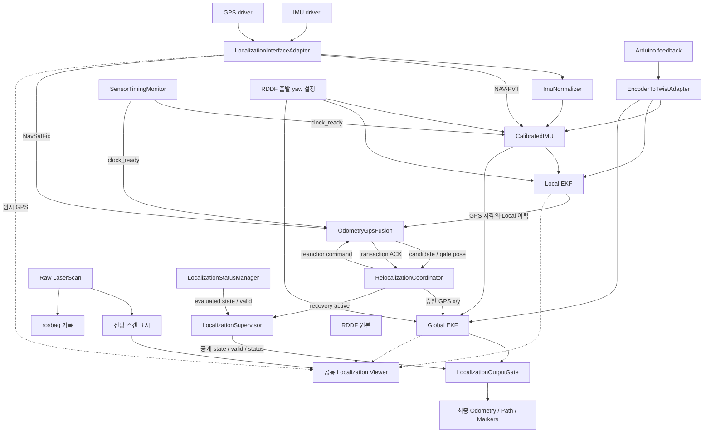

# 현재 Localization 아키텍처

현재 운영값·GPS 비활성 모드·반복 방향 보정·RDDF 연속 추적은 [최종 설정](final_configuration.md)을 기준으로 확인합니다. 아래 과거 실험 기록은 이번 snapshot의 검증 결과와 구분합니다.

ROS1 Noetic의 IMU·엔코더 기반 Local/Global 두 EKF, GPS 품질 게이트,
상태 감독과 최종 출력 게이트로 구성합니다. 라이다는 원시 스캔 수집과 표시에 사용합니다.

## 데이터 흐름

그림의 EKF 입출력은 InterfaceAdapter를 통해 공개 토픽과 고정 내부 토픽으로
연결됩니다. Adapter는 위치 계산·품질 판단을 하지 않습니다.
StatusManager는 보정 IMU·Twist·Local/Global·절대 위치와 게이트 상태를 관찰합니다.

## 책임과 실행 단위

| 실행 파일 | 책임 |
|---|---|
| `localization_interface_adapter_node` | 드라이버·EKF 내부 토픽과 공개 토픽 relay |
| `encoder_to_twist_adapter_node`, `imu_normalizer_node` | 엔코더 메시지 검증·속도 변환, IMU 형식·공분산 정규화 |
| `calibrated_imu_node.py` | RDDF 출발 yaw 초기화, 엔코더 0일 때 yaw·차량 Z 각속도 정지 제약, GNSS 직진 offset 정합 |
| `ekf_localization_node` 두 프로세스 | Local 연속 운동 추정, Global 절대 위치 융합 |
| `odometry_gps_fusion_node` | GPS 시각 정합, 좌표 투영·평면 레버암·innovation gate |
| `localization_supervisor_node` | StatusManager·Coordinator·Supervisor를 한 프로세스에서 실행 |
| `localization_output_gate_node` | 상태 승인과 Global 메시지 계약을 모두 통과한 최종 Odometry만 발행 |
| `static_transform_publisher_node` | 검증된 장착 TF 발행 |
| `localization_visualization_node` | 승인된 최종 위치의 공개 Path·MarkerArray 발행 |
| `localization_viewer.py`, `lidar_front_scan_visualizer.py` | 공통 RViz 화면과 표시용 전방 scan |
| `sensor_timing_monitor.py` | 호스트 시계 검사, 센서 시각 진단, clock_ready heartbeat |

Local과 Global EKF는 동일한 보정 IMU의 yaw·yaw rate, 엔코더 vx와 vy=0 제약을
사용합니다. Global은 Local Odometry 자체를 중복 융합하지 않고 승인된 GPS x/y를 추가로 융합합니다. Local Odometry는 절대 위치 정답이 아닙니다.

기본 시작은 [RDDF 초기화](rddf_startup.md)입니다. GPS 후보 또는 수동 선택으로 XY·차량 방향을 정하고 IMU·두 EKF에 적용한 결과를 확인합니다. 고정 `initial_heading.yaml` 출발 yaw는 `start_rddf_initialization:=false`일 때 사용합니다.

현재 RDDF는 원본 경로를 이어서 추적하고 주차 그룹과 미션 successor 요청을 처리합니다. Provider는 `/route/map` 카탈로그를 제공합니다.

## GPS 승인과 복구

현재 호스트 시각 검사 결과의 운행 차단은 `enforce_host_clock_ready: false`로 비활성입니다. GPS 자체의 시각·이력 검사는 유지됩니다.

현재 `quality.minimum_fix_status: 0`으로 ROS status 0/1/2를 추가 검사합니다.
RTK Fixed 전용 정책이 아닙니다. [GPS 문서](gps_quality_and_recovery.md)에
frame·시각·covariance·innovation 및 재연결 승인 조건을 설명합니다.

GPS gate는 2초 Local 이력에서 GPS 측정 시각의 pose를 보간합니다. clock_ready가
없거나 이력을 정합할 수 없으면 승인하지 않습니다. Global EKF는 2초 필터 이력으로
지연 측정을 재처리합니다. [센서 시각 문서](sensor_timing.md)를 참고합니다.

Coordinator만 공개 GPS pose를 발행합니다. 장기 복구는 gate가 해당 후보와 같은
시각의 Local로 anchor를 적용하고 같은 transaction을 ACK한 뒤 완료됩니다.
GPS-only 자동 Global reset은 현재 `false`이며, 지도 없는 기본 실행에서 장기
단절 후 임의의 새 위치로 자동 점프하지 않습니다.

Supervisor만 공개 상태와 valid를 결정하고, Output Gate가 최종 Odometry를
차단할 수 있습니다. 화면에 Local/Global이 보이는 사실은 최종 출력 승인과 다릅니다.
상태 우선순위는 [상태 문서](status_and_recovery.md)에 있습니다.

## TF와 표시 좌표

`map -> odom`은 Global EKF, `odom -> base_link`는 Local EKF가 발행합니다.
장착값과 검증 조건은 [TF 문서](tf_frames.md)를
기준으로 확인합니다.

공통 뷰어의 실시간 RDDF 초기화 구성은 `rddf_map`으로 XY·yaw를 그대로 표시합니다. 기존 recorded 표시 모드는 첫 원시 GPS와 첫 Local로 표시용 XY 이동을 정할 수 있습니다. 운영 TF·EKF 입력은 수정하지 않습니다. RDDF는 설계 경로이며 화면의 일치는 측량 ground truth 정확도 검증이 아닙니다.
